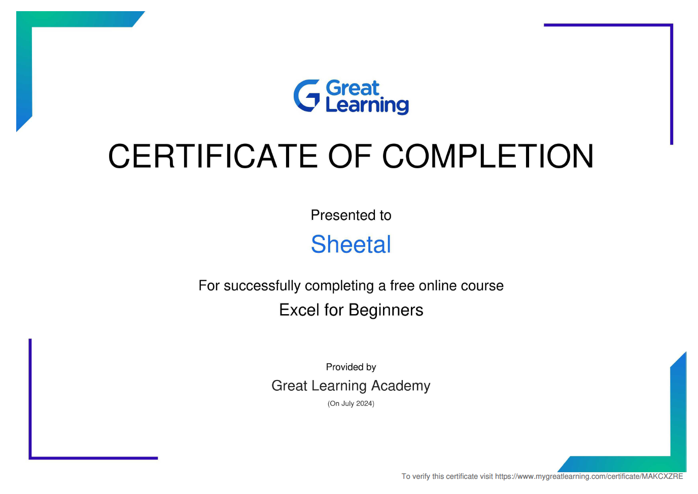

# Activity Report of the Student Induction Program (Batch 2024)

### SELF INTRODUCTION :

- **College Roll No.:** 2415265
- **Name:** Sheetal
- **Course:** B.Tech.
- **Branch:** Computer Science and Engineering (CSE)
- **Section:** E

### QUALIFICATION :

I completed my 12th grade at **Shaheed-E-Azam Sukhdev Thapar Girls Government Senior Secondary School, Ludhiana**. I achieved 97.6% in my 12th board exams and ranked 12th in Punjab.

## 🛠 Skills

I recently completed a course on MS-Excel, where I learned various advanced features and data analysis techniques.

### 🔗 EXCEL CERTIFICATE

## Induction Activities Report

| Date         | Resource Person               | Lessons                                                                                                                                                                                                                                                                                                                                                                                                                                                                                                                                                                                          |
| :----------- | :---------------------------- | :----------------------------------------------------------------------------------------------------------------------------------------------------------------------------------------------------------------------------------------------------------------------------------------------------------------------------------------------------------------------------------------------------------------------------------------------------------------------------------------------------------------------------------------------------------------------------------------------- |
| 11 July 2024 | Dr. Arvind Dhingra            | He is the chairman of the Technical Activies Committe and told us about the types of membership.He invited 22 students to play a game on the stage and through that game he made us all understant the importance of team work and strategic approach.He told us about 3Ps : Passion, Persistence and Passion                                                                                                                                                                                                                                                                                    |
|              | Dr. H.S. Rai                  | He is the controller of examination and made us realize that we are not supposed to be afraid of exams instead exams help us to know how much we really understood. Then he told us about CODE GNE where we can work on various technical activities. He told us about Markdown and github as well.                                                                                                                                                                                                                                                                                              |
| 12-July-2024 | Peer Interaction              | Our seniors interacted with us and taught us about the canva application and briefed about it too.                                                                                                                                                                                                                                                                                                                                                                                                                                                                                               |
|              | Mathematics                   | Pf. took a lecture on differentiation and helped us revise the concepts                                                                                                                                                                                                                                                                                                                                                                                                                                                                                                                          |
| 15-July-2024 | Dr. Randhir Singh             | He briefed us about GitHub and also helped us make a profile on it.                                                                                                                                                                                                                                                                                                                                                                                                                                                                                                                              |
|              | Dr. Pyare Lal                 | He taught us that with determination we can achieve any dream and it is very important to stay positive in life. Sir shared his thoughts in the form of poetries. He encouraged students to embrace this new journey of their life with enthusiasm                                                                                                                                                                                                                                                                                                                                               |
|              | Mr. Sony Goyal                | Mr. Goyal delived an energeic session on effective planning and taught us how to excel in engineering. He said that by giving 100% to any task, it becomes achievable.                                                                                                                                                                                                                                                                                                                                                                                                                           |
|              | Mr. Pancham                   | Very amazing and brlliant 4th year senior taught us about body language and non verbal communication using our facial expressions and hand gestures. He told us about leadership qualities as well.                                                                                                                                                                                                                                                                                                                                                                                              |
| 16-July-2024 | Peer Interaction              | Out seniors engaged us in many english activities. A quiz was organised to enhance out knowledge base. It was indeed very fun activity to do.                                                                                                                                                                                                                                                                                                                                                                                                                                                    |
| 18-July-2024 | Lectue of UHV                 | We studied the topic named as coexistance of body and soul, sources of imagination, understanding of harmony in relationship and nine feelings to make relationship a success.                                                                                                                                                                                                                                                                                                                                                                                                                   |
|              | Peer Interation               | We continued to work on canva app and also made a poster by using canva                                                                                                                                                                                                                                                                                                                                                                                                                                                                                                                          |
|              | Dr. Harvinder Singh           | Sir explained us about NCC and how to register for it as well. He told us that how by joining NCC, we can make very tremendous improvements in us.                                                                                                                                                                                                                                                                                                                                                                                                                                               |
|              | Dr. Jasvir Singh Grewal       | Sir told us about NSS, in which students contribute in development of community, environment and develop good leadership qualities.                                                                                                                                                                                                                                                                                                                                                                                                                                                              |
| 19-July-2024 | Dr. Kanwardeep Kalra          | She is ICBI certified soft skill trainer. She explained to us how soft skills are as important as technical skills. She told us how to behave during an interview with the help of a skit. It was really an amazing and informative session.                                                                                                                                                                                                                                                                                                                                                     |
|              | Jasvider Singh, Incharge-IAPT | Session with Jasvinder sir was both engaging and entertaining. The session started with the explanation of Sat-Sri-Akal and then demonstrated all the 206 bones in our body i.e 26 bones in each foot, 27 bones in each hand.28 bones in out face and skull, 52 bones in out chest, 5 bones in each arm, 5 bones in each leg which in total became 206 bones. It was quite interesting and with in couple of minutes we were able to meomorize all 206 bones. He also told us how to write the tabes of big numbers and made us fall in love with maths and science.                             |
|              | Departmental visit            | We visite the CS dept. and server room for the very first time                                                                                                                                                                                                                                                                                                                                                                                                                                                                                                                                   |
| 22-July-2024 | Dr. Pushpinder Singh          | The session started with discussion about different packages we can get after completing our degree. He encouraged us to read books such as `Wings of Fire ` and `Ignited Minds` by Dr. APJ Abdul Kalam. He told us about 3 learning styles - Surface Learning, Strategic Learning and deep study. He also told us one success formula: Your academic knowledge is only 15% of your success and rest 85% is human engineering, communication skills and perseverance. He also taught us about mental issues and their reasons. He also told us about the qualities of TQP (Total Quality People) |
|              | Sangeeta mam                  | Through a presentation mam showd us how a bad behavior towards nature imapcted many animal species. She also taught us how we can conserve out nature. Even a small step taken by us matters a lot. Seesion ended after discussion on sustainable development                                                                                                                                                                                                                                                                                                                                    |
|              | Parsad Vaidya                 | He told us about architecture and how real life buildings and various technoligies work. He also told us about Solar Decathlon India, where we can present out ideas. He also told us about the incoming competition in the same regard                                                                                                                                                                                                                                                                                                                                                          |
|              | Causmic Club                  | Our seniors performed Bhangra and enjoyed a lot                                                                                                                                                                                                                                                                                                                                                                                                                                                                                                                                                  |
| 23-July-2024 | Maths class                   | we did integration and hence strengthened out concepts                                                                                                                                                                                                                                                                                                                                                                                                                                                                                                                                           |
|              | Chemistry Class               | The class started with the brief introduction of each student and sir revised basics of chemistry and also taught us about NPTEL and MOOCS.                                                                                                                                                                                                                                                                                                                                                                                                                                                      |
| 24-July-2024 | IOC, Mr. Gauravdeep Singh     | He is the founder and chairman of `Initiators of Change`. He shared three valuable lessons with us, which were told by his mentors to him and in differnt situations of his life. The first lesson was ਸਾਂਝ ਕਰੀਜੈ ਗੁਣਹ ਕੇਰੀ ਛੋਡਿ ਅਵਗਣ ਚਲੀਏ, second one was ਜੋ ਬ੍ਰਹਮੰਡੇ ਸੋਈ ਪਿੰਡੇ ਜੋ ਖੋਜੇ ਸੋ ਪਾਵੇ and third one was ਰਬ ਸਬਦਾ ਭਲਾ ਕਰਦਾ ਹੈ                                                                                                                                                                                                                                                           |
|              | Pf. Yovraj Singh              | He said he in involed in each clud and thus we can ask him any query regarding any club.                                                                                                                                                                                                                                                                                                                                                                                                                                                                                                         |
| 26-July-2024 | Dr. Kanwalpreet K Bhat        | She is meditaion councellor and homeopathic practitioner. She explained to us about meditaion and its benefits at length. She also made us all meditate for 15 minutes and that meditaion session was really made us all feel really good.                                                                                                                                                                                                                                                                                                                                                       |
|              | Valedictory                   | Varois competitions were organised such as singing and dancing. 1st year students performed in various competitions. Our seniors also entertained us with their amazing mimicry, singing and dancing.                                                                                                                                                                                                                                                                                                                                                                                            |

## My Experience

The induction program was an enriching experience filled with new learning and life lessons. It gave me an opportunity to interact with inspiring personalities and gain insights into college life. I feel more confident and excited to embark on this new journey. I am grateful to all the professors and seniors who organized this program and made it memorable.
